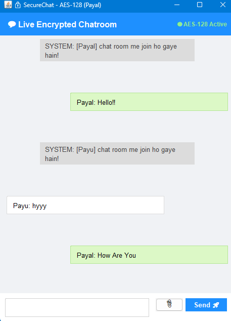
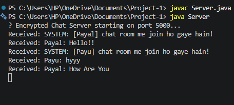

# 🔒 End-to-End Encrypted Peer-to-Peer Chat Application

A high-security, multi-threaded Java Chat Application built to secure real-time network communications using **AES-128 Encryption** and **Socket Programming**.

---

## 🖼️ Application Screenshots & Demo

### 1. Multi-User Live Encrypted Chatroom UI


### 2. Backend Server Logs & Real-Time Connection


---

## ⚡ Key Features & Security Architecture

* **AES-128 Encryption Pipeline:** 
  Secures messaging payloads using **AES-128 symmetric encryption**, ensuring encrypted communication over local network sockets.
* **Multi-threaded Client-Server Engine:** 
  Leverages Java Threads (`Runnable`) and Concurrent Sockets (`java.net.Socket`, `ServerSocket`) to handle multiple client connections simultaneously.
* **Java Swing GUI Interface:** 
  Custom-built desktop client UI featuring live encrypted message status and dynamic chat bubbles.

---

## 🛠️ Tech Stack & Concepts Used

* **Language:** Core Java (JDK 17+)
* **Cryptography:** `javax.crypto` (AES-128 Encryption & Decryption)
* **Networking:** Java Socket Programming (`java.net.Socket`, `ServerSocket`)
* **Concurrency:** Java Multi-threading (`Thread`, `Runnable`)
* **UI/Visualization:** Java Swing (`JFrame`, `JDialog`)

---

## 🚀 How to Run Locally

### Prerequisites
* Java Development Kit (JDK 17 or higher) installed.

### Execution Steps
1. **Compile Server & Client:**
   ```bash
   javac Server.java
   javac Client.java

   
Start Encrypted Chat Server:

 Bash
 java Server

Start Client Application (Run in multiple terminals for multiple users):

 Bash
 java Client